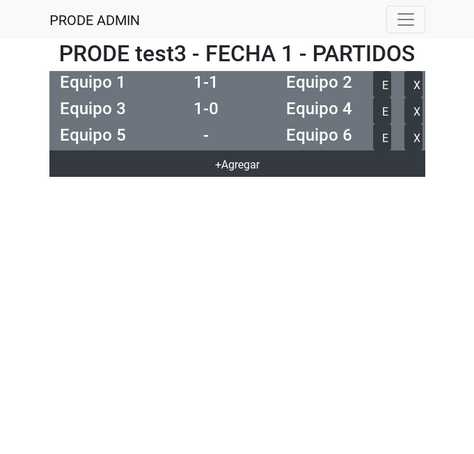
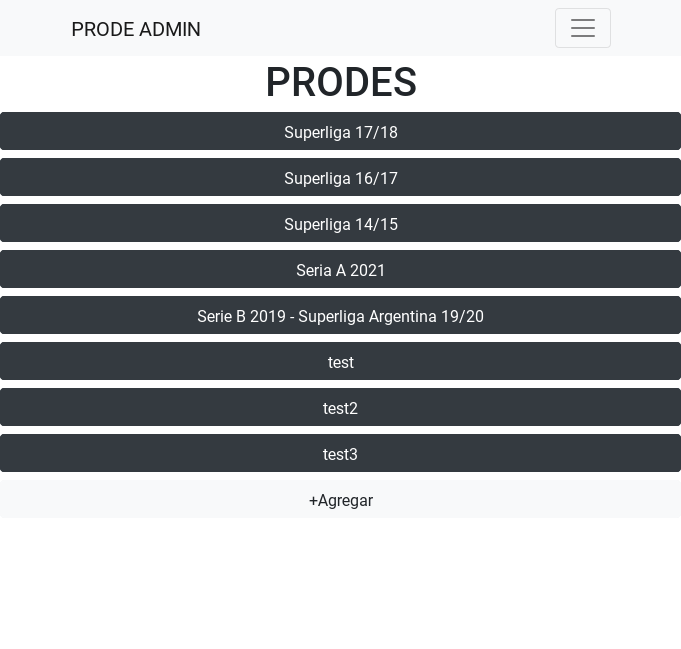
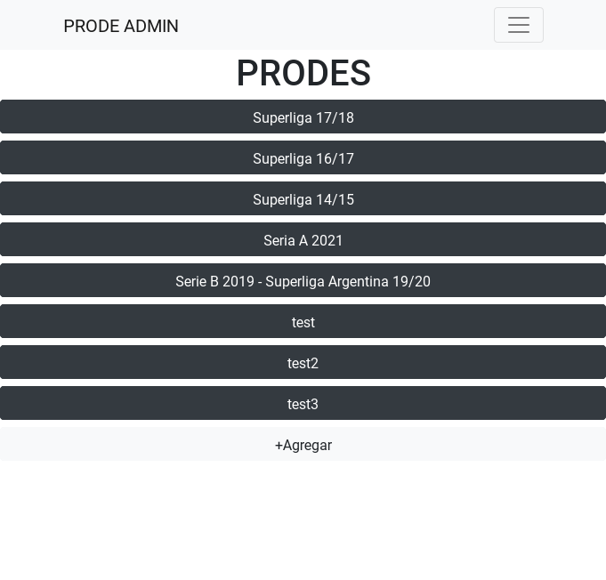
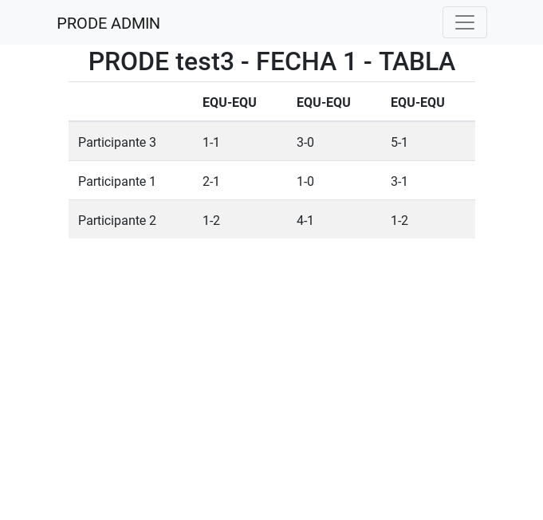
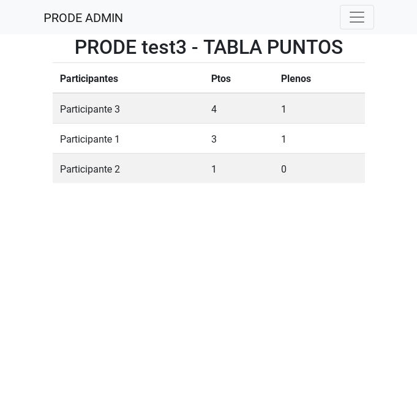
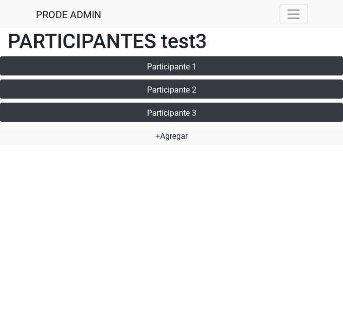

Está casi terminado, funciona correctamente pero falta poder eliminar partidos, pronósticos y nombres de participantes, corregir algunos bugs y ordernar los archivos.

Faltan escribir los tests.

To run it:
```
pip install -r requirements.txt
python manage.py makemigrations
python manage.py migrate
python manage.py runserver
```

Some images:
<dl>
	
	
	
	
	
	

</dl>